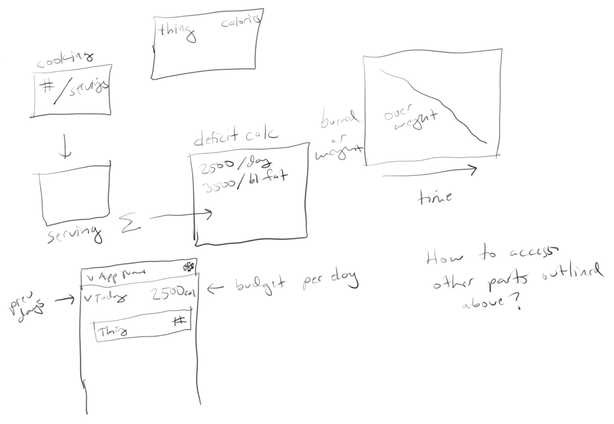

# Progress

### 02-23-2020
I acknowledge that I have a bad habit of starting/stopping projects.
This app though is a starting point for what I'm trying to work on which will "run" my life in a way.
The calorie counter, burn rate are the main apps I'll integrate at this time and general reminders like a remote-wrapper for the sms Twilio remind me that I use everyday
[This](
https://developer.mozilla.org/en-US/docs/Web/Progressive_web_apps/Re-engageable_Notifications_Push) will be handy, as PWAs are like my "mobile app" right now until I have the time to commit to RN, I may also switch to a Mac at some point just because of how much easier it is to develop cross platform on one.
Although I won't till I get rid of my windows laptop which sadly no one wants according to eBay ha

Man... it's tough... I'm distracted but I'm still trying to conceptualize this UI, it has a lot of parts to it. Google Spreadsheet has been helpful to formulate parts of the app.
There's also a concern of wasted real estate with the multi-sub-app loader thing in the banner.

### 09-11-2019
not much today, just integrated the calorie counter app into the fitness "sub-app"  
one issue on the mind which I will have to address is the deprecation of componentWillMount... I tried to just stick the init state code somewhere  
but it wasn't working right... I mean I'm using a state object and also trying to use a constructor  
I will need to address this with the integration of IndexedDB. I'm hesitant to make much progress with anything that saves  
until I get IndexedDB in.  
Also I am aware of the date, moment of silence

### 09-10-2019
- added routing
  - using Link
  - back button in header
- added font

#### Base design

### 09-09-2019
Just started this at this time